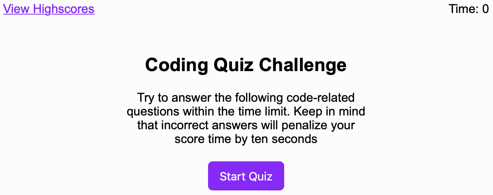
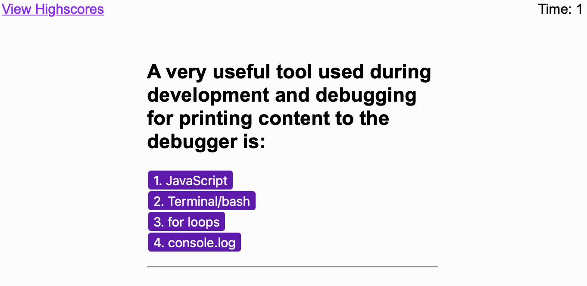
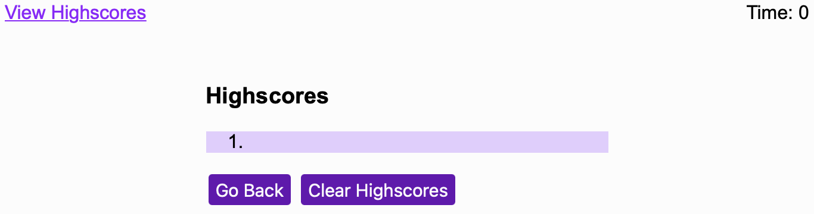

# Code-Quiz

## Description

This application tests people on their knowledge of JavaScript, and allows people to see their progress by saving their previous scores.

## Access

The following link: https://sophiekdj.github.io/Code-Quiz/

## Usage

When the page is first loaded it will look like this:

Once you click on the "Start Quiz" button you will be given multiple choice questions based around JavaScript:

When you click the "Submit" button or press "View Highscores" in the top left of the page, you will be taken to the highscore page:

